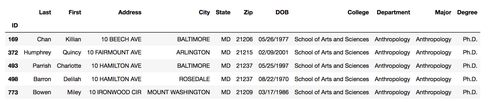

~~~
# import the pandas package
import pandas as pd
~~~
{: .language-python}

~~~
# examine the built-in documentation (and in the process, confirm that pandas imported as expected)
help(pd)
~~~
{: .language-python}

~~~
Help on package pandas:

NAME
    pandas

DESCRIPTION
    pandas - a powerful data analysis and manipulation library for Python
    =====================================================================

    **pandas** is a Python package providing fast, flexible, and expressive data...
~~~
{: .output}

> ## REM: be consistent
> If you used an alias when importing, remember to use it when seeking help (and elsewhere)...
> ~~~
> help(pandas)
> ~~~
> {: .language-python}
> ~~~
> ---------------------------------------------------------------------------
> NameError                                 Traceback (most recent call last)
> <ipython-input-1-fd00b05d7349> in <module>
>       1 # if you used an alias when importing, remember to use it when using help
> ----> 2 help(pandas)
>
> NameError: name 'pandas' is not defined
> ~~~
> {: .error}
{: .callout}

Beyond using `help` to learn about the capabilities of an imported package, we can also use `dir` to see the available methods...
~~~
dir(pd)
~~~
{: .language-python}

~~~
['Categorical',
 'CategoricalDtype',
 'CategoricalIndex',
 'DataFrame',
 ...
 'read_clipboard',
 'read_csv',
 'read_excel'
 ...]
~~~
{: .output}

Once we've found a method that looks promising, we can again use `help` for more information...
~~~
help(pd.read_csv)
~~~
{: .language-python}
~~~
Help on function read_csv in module pandas.io.parsers:

read_csv(filepath_or_buffer, sep=',', delimiter=None, header='infer', names=None, index_col=None, usecols=None, squeeze=False, prefix=None, mangle_dupe_cols=True, dtype=None, engine=None, converters=None, true_values=None, false_values=None, skipinitialspace=False, skiprows=None, skipfooter=0, nrows=None, na_values=None, keep_default_na=True, na_filter=True, verbose=False, skip_blank_lines=True, parse_dates=False, infer_datetime_format=False, keep_date_col=False, date_parser=None, dayfirst=False, iterator=False, chunksize=None, compression='infer', thousands=None, decimal=b'.', lineterminator=None, quotechar='"', quoting=0, doublequote=True, escapechar=None, comment=None, encoding=None, dialect=None, tupleize_cols=None, error_bad_lines=True, warn_bad_lines=True, delim_whitespace=False, low_memory=True, memory_map=False, float_precision=None)
    Read a comma-separated values (csv) file into DataFrame.

    Also supports optionally iterating or breaking of the file
    into chunks.

    Additional help can be found in the online docs for
    `IO Tools <http://pandas.pydata.org/pandas-docs/stable/io.html>`_.
...
~~~
{: .output}

Armed with this knowledge, we can now put it into use...
~~~
# import our data from a csv file
data = pd.read_csv('patron.csv')

# see all the data
print(data)
~~~
{: .language-python}

~~~
        ID           Last          First               Address  \
0      169           Chan        Killian          10 BEECH AVE   
1      372       Humphrey         Quincy      10 FAIRMOUNT AVE   
2      493        Parrish      Charlotte       10 HAMILTON AVE   
3      498         Barron        Delilah       10 HAMILTON AVE   
4      773          Bowen          Miley       10 IRONWOOD CIR
...
~~~
{: .output}

~~~
# see how the data is being interpreted by python
data.info()
~~~
{: .language-python}

~~~
<class 'pandas.core.frame.DataFrame'>
RangeIndex: 3455 entries, 0 to 3454
Data columns (total 12 columns):
ID            3455 non-null int64
Last          3455 non-null object
First         3455 non-null object
Address       3455 non-null object
City          3454 non-null object
State         3455 non-null object
Zip           3455 non-null int64
DOB           3455 non-null object
College       3455 non-null object
Department    3455 non-null object
Major         3455 non-null object
Degree        3455 non-null object
dtypes: int64(2), object(10)
memory usage: 324.0+ KB
~~~
{: .output}

Notice that an additional column (the RangeIndex) has been added to our data to number the rows. Since we already have an ID column for this, we should use it instead...

~~~
# re-read the data, using the ID column as the index
data = pd.read_csv("patron.csv", index_col='ID')

# check the result
data.info()
~~~
{: .language-python}

~~~
<class 'pandas.core.frame.DataFrame'>
Int64Index: 3455 entries, 169 to 604
Data columns (total 11 columns):
Last          3455 non-null object
First         3455 non-null object
Address       3455 non-null object
City          3454 non-null object
State         3455 non-null object
Zip           3455 non-null int64
DOB           3455 non-null object
College       3455 non-null object
Department    3455 non-null object
Major         3455 non-null object
Degree        3455 non-null object
dtypes: int64(1), object(10)
memory usage: 323.9+ KB
~~~
{: .output}

~~~
# and see how it prints out
print(data)
~~~
{: .language-python}

~~~
               Last          First               Address              City  \
ID                                                                           
169            Chan        Killian          10 BEECH AVE         BALTIMORE   
372        Humphrey         Quincy      10 FAIRMOUNT AVE         ARLINGTON   
493         Parrish      Charlotte       10 HAMILTON AVE         BALTIMORE   
498          Barron        Delilah       10 HAMILTON AVE          ROSEDALE   
773           Bowen          Miley       10 IRONWOOD CIR  MOUNT WASHINGTON
~~~
{: .output}

With the additional index column gone, there's a little more room for our data.
We can do better, though...

~~~
# use pandas' head function to see the first 5 rows of data (formatted a little nicer...)
data.head()
~~~
{: .language-python}

  
*Screenshot of the output from data.head() - a formatted table with five rows of data*

Let's take another look at our info, to see if we can make any other improvements in how we read our data...

~~~
data.info()
~~~
{: .language-python}

~~~
<class 'pandas.core.frame.DataFrame'>
Int64Index: 3455 entries, 169 to 604
Data columns (total 11 columns):
Last          3455 non-null object
First         3455 non-null object
Address       3455 non-null object
City          3454 non-null object
State         3455 non-null object
Zip           3455 non-null int64
DOB           3455 non-null object
College       3455 non-null object
Department    3455 non-null object
Major         3455 non-null object
Degree        3455 non-null object
dtypes: int64(1), object(10)
memory usage: 323.9+ KB
~~~
{: .output}

Notice that our date-of-birth (DOB) column isn't being interpreted as a date. We can fix this by telling pandas how to parse that column. The parse_dates argument of pandas' read_csv() function just needs to know the indexes of the columns that should be interpreted as dates. Remember that in python, indexes start at zero and that ID is still our first column (even though the output of info no longer counts it as a _data_ column).

~~~
# re-read our data, parsing the DOB column (which has index 7) as dates
data = pd.read_csv("patron.csv", index_col='ID', parse_dates=[7])

# confirm that DOB is now a datetime object
data.info()
~~~
{: .language-python}

~~~
<class 'pandas.core.frame.DataFrame'>
Int64Index: 3455 entries, 169 to 604
Data columns (total 11 columns):
Last          3455 non-null object
First         3455 non-null object
Address       3455 non-null object
City          3454 non-null object
State         3455 non-null object
Zip           3455 non-null int64
DOB           3455 non-null datetime64[ns]
College       3455 non-null object
Department    3455 non-null object
Major         3455 non-null object
Degree        3455 non-null object
dtypes: datetime64[ns](1), int64(1), object(9)
memory usage: 323.9+ KB
~~~
{: .output}

~~~
# check our work, this time using tail to see the last 5 rows of our data
data.tail()
~~~
{: .language-python}

  
*Screenshot of the output from data.tail() - a formatted table with five rows of data*

By the way our DOB column is being formatted (year-month-date, rather than month/day/year), we can tell that it's being interpreted as date information, so we can now treat it as such.


